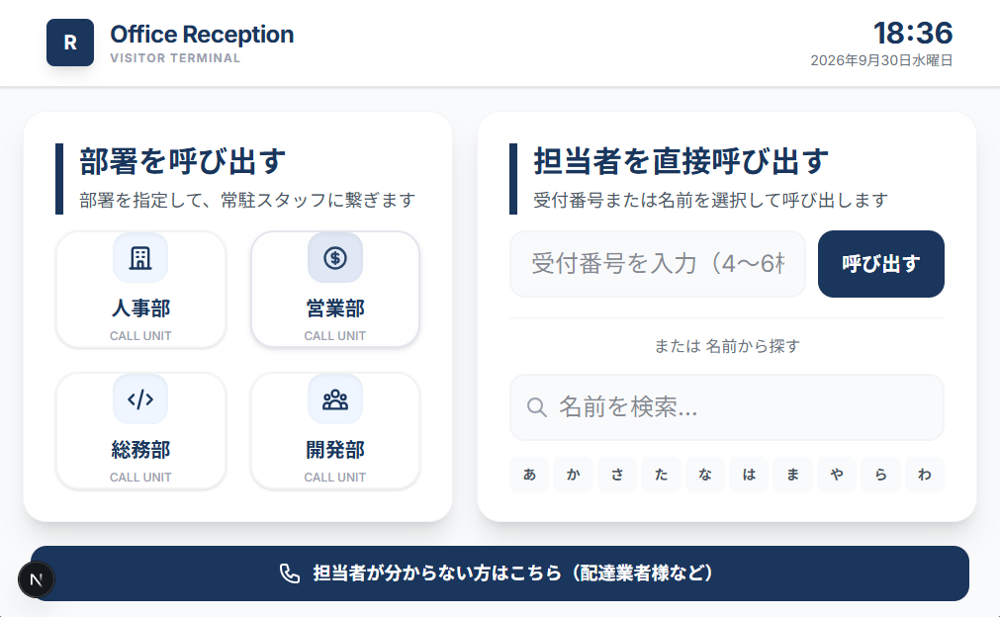
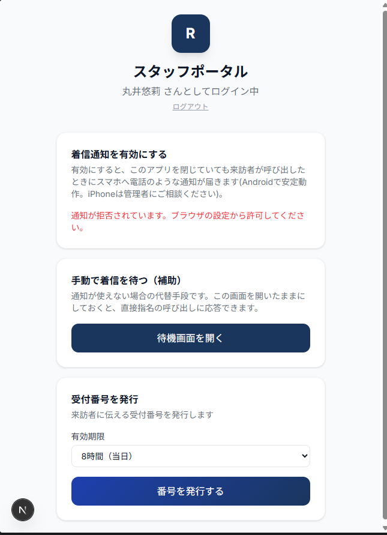
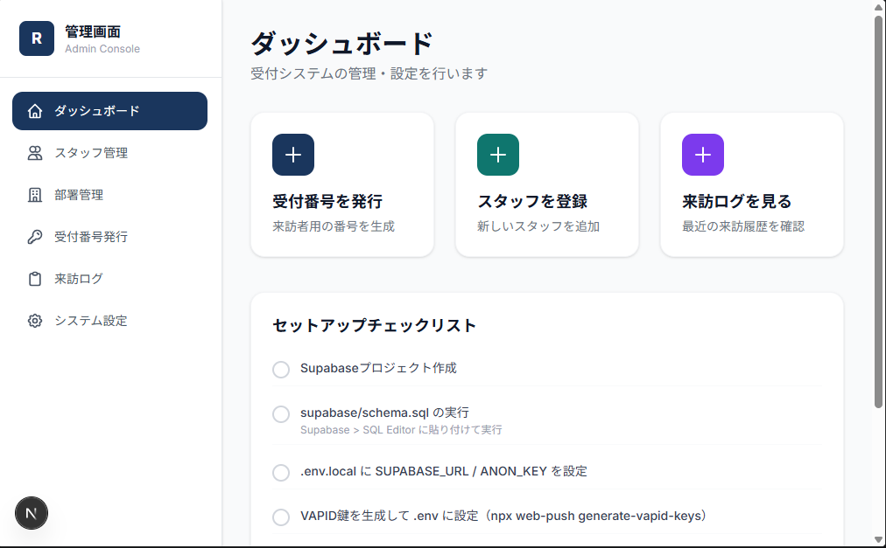
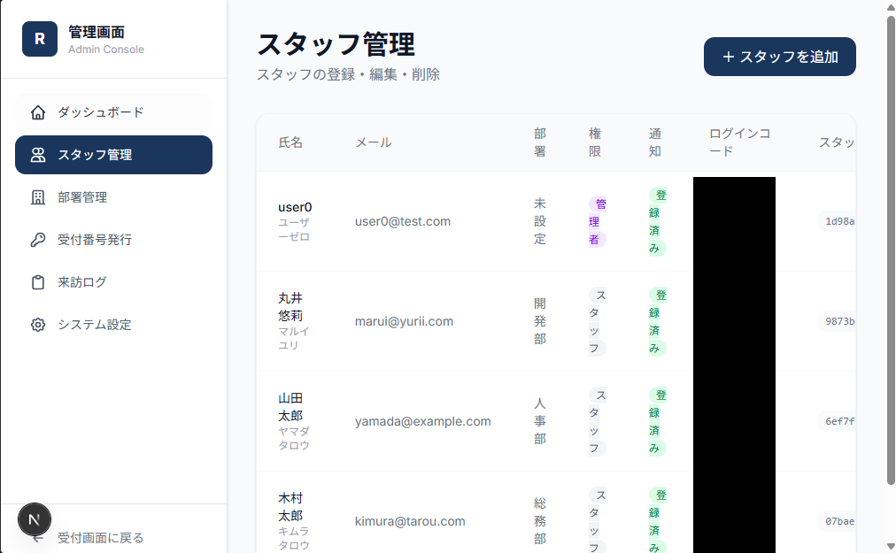
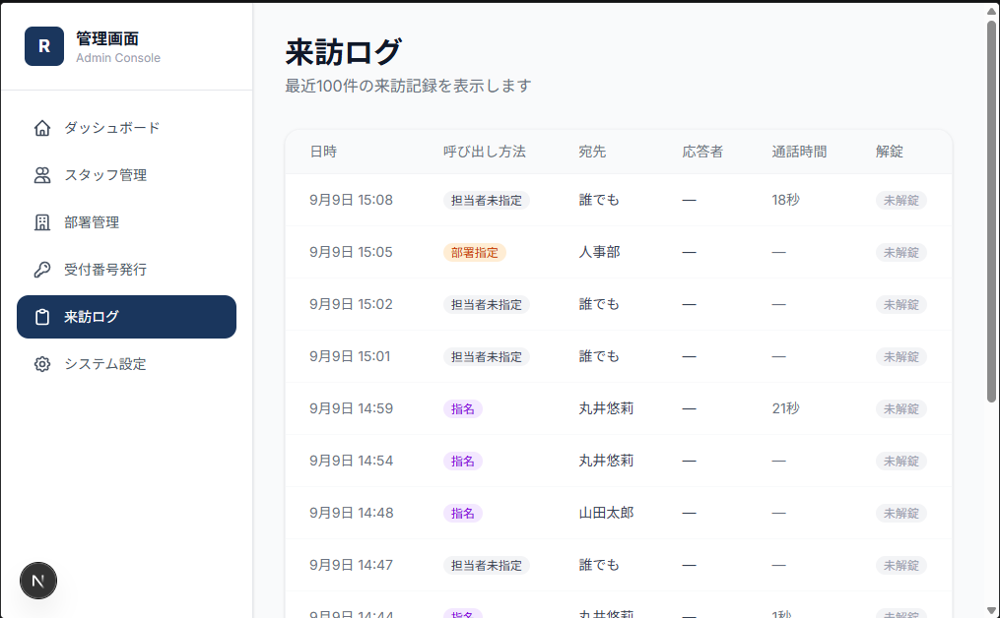

# 📞 オフィス無人受付システム

来訪者がエントランスのタブレットを操作するだけで担当者のスマートフォンにビデオ通話が届き、顔を確認したその場で電気錠を解錠できる無人受付システムです。実際にオフィスで運用することを想定して設計・開発しました。

開発には [Claude Code](https://claude.com/claude-code) を活用しています。要件定義・画面設計・動作確認は自分で行い、実装は対話しながらAIと一緒に進めました。

## デモ



来訪者は「部署を指定」「担当者を直接指名」「受付番号」「担当者が分からない（配達業者など）」の4パターンから呼び出し方法を選べます。

## できること

### 来訪者側
- 部署・担当者名・受付番号のいずれかで呼び出し
- 誰に繋げばよいか分からない来訪者向けの「担当者未指定」呼び出しにも対応
- ブラウザだけで動作（アプリのインストール不要）

### スタッフ側
- スマートフォンでPWAとしてホーム画面に追加すると、電話の着信のようなプッシュ通知が届く
- WebRTCによるP2Pビデオ通話でその場で顔を確認
- ワンタップで電気錠（Sesame）を解錠
- 指定時間応答がない場合は自動で管理者へ転送（エスカレーション）
- ログイン不要の共有タブレットを「予備の受付端末」として同時運用可能（個人のスマホの通知に気づけなかった場合の保険）



### 管理者側



- スタッフ・部署・受付番号の管理
- 来訪ログの記録・閲覧（呼び出し方法・宛先・応答者・通話時間・解錠有無）
- エスカレーション設定・電気錠の手動操作




## 技術スタック

| 領域 | 技術 |
|---|---|
| フロントエンド | Next.js 16 (App Router) / TypeScript / Tailwind CSS |
| バックエンド | Node.js / Express / Socket.io |
| リアルタイム映像通話 | WebRTC（P2P・サーバー負荷なし） |
| データベース | Supabase (PostgreSQL) / Row Level Security |
| 通知 | Web Push (PWA) / Slack Incoming Webhook |
| 電気錠連携 | Sesame API |
| インフラ | Vercel（フロントエンド）/ Render（バックエンド） |

## 工夫した点

- **サーバーコストゼロでのビデオ通話**: WebRTCのP2P接続を使い、映像そのものはサーバーを経由しない設計にすることで、通話量に応じた課金が発生しない構成にしました
- **通知が届かない場合の多重の保険**: スマホのWeb Push通知に加えて、iPhoneなど通知が不安定な端末向けにSlack通知、さらにログイン不要の共有タブレットも同時に着信を受けられるようにし、「誰にも気づかれない」状況を防いでいます
- **PWAとして複数の役割を共存させる**: 来訪者用・スタッフ用・管理者用で別々のWeb Appマニフェストを用意し、同じドメインでもそれぞれ独立したアプリとしてホーム画面に追加できるようにしました
- **Supabase RLSによる権限分離**: 来訪者向け画面（匿名アクセス）と管理者向け画面（認証必須）で、読み取れる情報を列単位・行単位で制御しています

## ディレクトリ構成

```
frontend/    Next.js（Vercelにデプロイ）
backend/     Node.js + Express（Renderにデプロイ）
supabase/    テーブル定義・RLS設定
```
